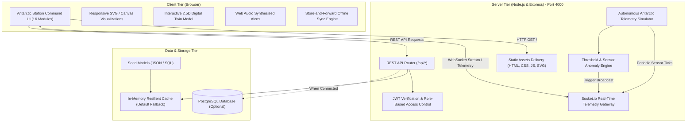

# Antarctic Station Command — System Architecture

## Architectural Highlights
1. **Zero-Configuration Fallback**: The server starts instantly with built-in in-memory fallback stores, meaning PostgreSQL is optional.
2. **Integrated Port Architecture**: Both the interactive frontend and backend API endpoints run together on **Port 4000**.
3. **Store-and-Forward Telemetry**: Supports intermittent satellite communication with an offline queue that replays telemetry upon link reconnection.
4. **Role-Based Access Control (RBAC)**: Supports 5 specialized mission roles (Station Commander, Operations Engineer, Lead Scientist, Medical Officer, and Observer).
